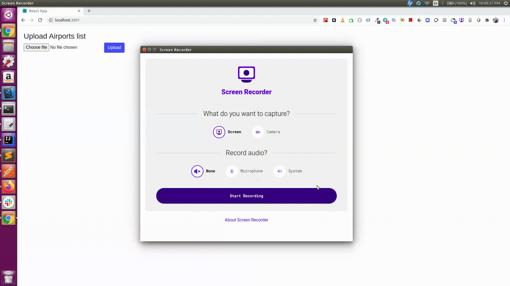

### `npm start`

Runs the app in the development mode. 
Open [http://localhost:3000](http://localhost:3000) to view it in the browser.

## Checkout below node js file upload repo and run `node main.js`
Open [https://github.com/vishnuvv/nodejs-file-upload](https://github.com/vishnuvv/nodejs-file-upload) to view it in the browser.

## Upload the airports json file 
## Now click on the getairport button which populates the dropdown with airports

